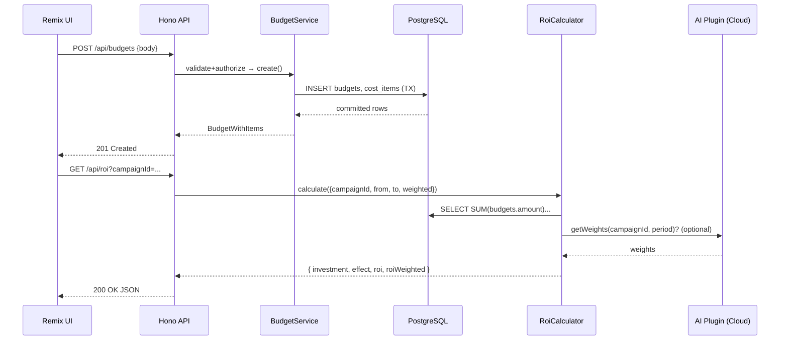

# 詳細設計書 - 予算モジュール (Budget)

## 1. アーキテクチャ概要

### 1.1 システム構成図

```mermaid
flowchart LR
  subgraph UI[Remix UI]
    BUI[Budget Screens]
  end

  subgraph API[Hono API (Core)]
    CTRL[Budgets Controller]
    ROIAPI[ROI Controller]
    AUTH[Auth + RBAC]
    VAL[Zod Validation]
  end

  subgraph SVC[Service Layer]
    BSV[BudgetService]
    CSV[CampaignService]
    ROI[RoiCalculator]
    REG[Plugin Registry]
  end

  subgraph DB[(PostgreSQL)]
    T1[(campaigns)]
    T2[(budgets)]
    T3[(cost_items)]
  end

  subgraph PLUGINS[Cloud Plugins]
    AI[AI Attribution]
    CRM[CRM Sync]
  end

  BUI -->|HTTP/JSON| CTRL
  CTRL --> AUTH
  CTRL --> VAL
  CTRL --> BSV
  ROIAPI --> ROI
  BSV --> CSV
  BSV --> DB
  CSV --> DB
  ROI --> DB
  ROI --> REG
  REG --> AI
  AI -.optional .-> ROI
```

### 1.2 技術スタック

- 言語: TypeScript 5.9+（ES2022, strict, exactOptionalPropertyTypes）
- フレームワーク: Hono（API）, Remix 2.x（UI）
- ライブラリ: Drizzle ORM + `pg`, Zod, date-fns, nanoid, undici
- テスト: Vitest, Supertest（API統合）, Playwright（E2E-UI 参照用）
- データベース: PostgreSQL 15（`numeric(19,4)`で金額保持）
- ツール: pnpm, Docker Compose, ESLint 9, Prettier

## 2. コンポーネント設計

### 2.1 コンポーネント一覧

| コンポーネント名            | 責務                                           | 依存関係                          |
| --------------------------- | ---------------------------------------------- | --------------------------------- |
| `BudgetsController`        | HTTP入出力, バリデーション, 認可, サービス呼び出し | Auth, Zod, BudgetService          |
| `RoiController`            | ROI算出APIの入出力                              | RoiCalculator, Auth               |
| `BudgetService`            | 予算/費用のビジネスロジック, 整合性, 監査          | Repositories, CampaignService     |
| `CampaignService`          | 施策（キャンペーン）関連の参照/整合性             | CampaignRepository                |
| `RoiCalculator`            | 投資総額の集計, 効果値参照, ROI/加重ROIの計算     | BudgetRepository, PluginRegistry  |
| `PluginRegistry`           | プラグインの検出/呼び出し（AI Attribution, CRM） | Cloud Plugin Runtime              |
| `BudgetRepository`         | `budgets` CRUD, 集計クエリ                        | Drizzle ORM, PostgreSQL           |
| `CostItemRepository`       | `cost_items` CRUD, 明細操作                       | Drizzle ORM, PostgreSQL           |
| `CampaignRepository`       | `campaigns` CRUD                                 | Drizzle ORM, PostgreSQL           |
| `Auth/RBAC Middleware`     | JWT検証, テナント分離, 権限制御                   | JWT, DB（tenant_id）              |
| `Validation Schemas (Zod)` | APIの入出力スキーマ                              | Zod                               |

### 2.2 各コンポーネントの詳細

#### BudgetsController

- 目的: 予算/費用エンドポイントの入出力制御と認可
- 公開インターフェース（例）:
  ```typescript
  // route: /api/budgets
  export type ListBudgetsQuery = {
    campaignId?: string;
    category?: string;
    owner?: string;
    from?: string; // ISO
    to?: string;   // ISO
    limit?: number; // default 50
    cursor?: string; // pagination
  };

  export type CreateBudgetBody = {
    campaignId: string;
    category: string; // event | labor | ads | tools | outsourcing | other
    amount: string;   // decimal string
    currency: string; // e.g. JPY, USD
    owner?: string;
    spentAt: string;  // ISO date
    source?: string;
    costItems?: Array<{
      type: string;
      description?: string;
      cost: string; // decimal
      unit?: string;
      quantity?: number;
    }>;
  };
  ```
- 内部実装方針:
  - Zodで入力検証 → RBACで権限確認 → `BudgetService` に委譲
  - POSTは`Idempotency-Key`ヘッダで多重登録防止（テーブルにキー記録）
  - ページネーションは`cursor`ベース（spent_at, budget_idの複合）

#### RoiController

- 目的: ROI算出APIの提供（通常/AI加重）
- 公開インターフェース（例）:
  ```typescript
  export type RoiQuery = {
    campaignId: string;
    from?: string; // ISO
    to?: string;   // ISO
    weighted?: boolean; // AI Attributionを使う場合true
  };
  ```
- 内部実装方針:
  - `RoiCalculator.calculate()` 呼び出し
  - 期間フィルタはDB側で絞込、加重値はPluginから取得（有効時のみ）

#### BudgetService

- 目的: 予算・費用登録の整合性維持、集計サマリー作成
- 公開インターフェース:
  ```typescript
  interface BudgetService {
    list(q: ListBudgetsQuery, ctx: Ctx): Promise<Paginated<Budget>>;
    create(input: CreateBudgetBody, ctx: Ctx): Promise<BudgetWithItems>;
    update(id: string, patch: Partial<CreateBudgetBody>, ctx: Ctx): Promise<BudgetWithItems>;
  }
  ```
- 内部実装方針:
  - 通貨・金額は小数誤差回避のため`numeric(19,4)`使用、計算はDecimalユーティリティ採用
  - `CampaignService.ensureExists(campaignId)`で整合性チェック
  - CostItemはトランザクション内で子レコード一括作成/更新
  - 監査用に`created_by`, `updated_by`, `idempotency_key`を保持

#### RoiCalculator

- 目的: 期間・施策単位でROI/加重ROI算出
- 公開インターフェース:
  ```typescript
  type RoiInput = { campaignId: string; from?: Date; to?: Date; weighted?: boolean };
  type RoiOutput = { investment: string; effect: string; roi: number; roiWeighted?: number };

  interface RoiCalculator {
    calculate(input: RoiInput, ctx: Ctx): Promise<RoiOutput>;
  }
  ```
- 内部実装方針:
  - 投資額: `budgets`/`cost_items`集計（期間・カテゴリ絞込）
  - 効果値: CRM/ファネル由来の数値（プラグイン or 既存サービスから取得）
  - weighted=true時は`PluginRegistry.aiAttribution.getWeights(campaignId, period)`を掛け合わせ
  - 計算式:
    - `roi = (effect - investment) / investment`
    - `roiWeighted = Σ(weight_i × effect_i) / Σ(investment)`

## 3. データフロー

### 3.1 データフロー図



### 3.2 データ変換

- 入力データ形式: JSON（Remix Form→fetch）。金額は文字列（十進）で受領。
- 処理過程: Zod正規化 → Decimal変換 → DB `numeric(19,4)` 永続化。
- 出力データ形式: JSON。金額は小数点文字列で返却（通貨はISO 4217コード付与）。

## 4. APIインターフェース

### 4.1 内部API（サービス層）

```typescript
type Ctx = { tenantId: string; userId: string; roles: string[] };

interface BudgetRepository {
  list(q: ListBudgetsQuery, ctx: Ctx): Promise<Paginated<Budget>>;
  insert(b: NewBudget, items: NewCostItem[], ctx: Ctx): Promise<BudgetWithItems>;
  update(id: string, patch: Partial<NewBudget>, items?: UpsertCostItem[], ctx?: Ctx): Promise<BudgetWithItems>;
}

interface CampaignService {
  ensureExists(campaignId: string, ctx: Ctx): Promise<void>;
}

interface PluginRegistry {
  aiAttribution?: {
    getWeights(campaignId: string, period: { from?: Date; to?: Date }, ctx: Ctx): Promise<Array<{activityType: string; weight: number}>>;
  };
}
```

### 4.2 外部API（REST）

- `GET /api/budgets`
  - Query: `campaignId, category, owner, from, to, limit(<=200), cursor`
  - 200: `{ data: Budget[], nextCursor?: string }`

- `POST /api/budgets`
  - Headers: `Idempotency-Key`（任意）
  - Body: `CreateBudgetBody`
  - 201: `BudgetWithItems`
  - 409: 既存`Idempotency-Key`

- `PATCH /api/budgets/:id`
  - Body: `Partial<CreateBudgetBody>`
  - 200: `BudgetWithItems`

- `GET /api/campaigns` / `POST /api/campaigns`
  - 最低限のCRUD（名称, 期間, 目的, 予算上限）

- `GET /api/roi?campaignId=...&from=...&to=...&weighted=true|false`
  - 200: `{ investment: string, effect: string, roi: number, roiWeighted?: number }`

スキーマはOpenAPI 3.0 に追記（Task 3.1の方針に従う）。

## 5. エラーハンドリング

### 5.1 エラー分類

- ValidationError(400): Zodスキーマ不一致、金額/通貨/日付の不正
- AuthError(401)/PermissionError(403): JWT無効、RBAC不足
- NotFound(404): campaign/budgetが存在しない
- Conflict(409): Idempotency-Key重複、同時更新検出（`updated_at`楽観ロック）
- RateLimit(429): テナント毎のAPI制限
- ServerError(500)/UpstreamError(502/504): DB/プラグイン障害

### 5.2 エラー通知

- 構造化ログ（JSON, requestId, tenantId, userId, path, latency, outcome）
- 重要障害はWebhookまたはSlack通知（後続タスクで設定）
- 監査ログ: 重要操作（作成/更新/削除、金額変更）の記録

## 6. セキュリティ設計

### 6.1 認証・認可

- JWT認証（Task 8.x）。`tenant_id`を必須とし、RBAC: Admin/Manager/Viewer/AI Engine。
- RLS想定: 全テーブルに`tenant_id`を付与。アプリ層でも必ず`tenant_id`で絞り込み。

### 6.2 データ保護

- 金額は`numeric(19,4)`、通貨はISOコード。PII（owner等）は必要に応じて暗号化列。
- 監査用`idempotency_key`, `created_by`, `updated_by` 保存。

## 7. テスト戦略

### 7.1 単体テスト

- カバレッジ目標: 80%+
- フレームワーク: Vitest
- 対象: `RoiCalculator`（境界値、weighted on/off）、`BudgetService`（通貨/金額検証、item集約、idempotency）

### 7.2 統合テスト

- API: Vitest + Supertest（Docker PostgreSQL利用）。主要CRUD/検索/ページング/競合/認可を網羅。
- プラグイン: AI Attributionはモック/スタブで重み付けの合成を検証。

## 8. パフォーマンス最適化

### 8.1 想定される負荷

- 1テナントあたり月間数万件の費用行、一覧クエリは期間/カテゴリでの集計が中心。

### 8.2 最適化方針

- インデックス: `budgets(tenant_id, campaign_id, spent_at)`, `budgets(category)`, `cost_items(budget_id)`
- ページング: `spent_at DESC, budget_id DESC`のシーク方式
- ROIの重い集計は短時間キャッシュ（Redis 1〜5分, optional）

## 9. デプロイメント

### 9.1 デプロイ構成

- Docker ComposeでAPI + PostgreSQL。クラウドではマネージドDB推奨。
- マイグレーションは起動時に自動適用（手動ロールバック手順をドキュメント化）。

### 9.2 設定管理

- 環境変数: `DATABASE_URL`, `JWT_SECRET`, `FEATURE_AI_ATTRIBUTION`, `TZ`, `LOG_LEVEL`
- 機密はSecret Manager or `.env`（開発）で管理。

## 10. 実装上の注意事項

- 通貨/金額:
  - 入力は文字列十進で受領し、`numeric(19,4)`へ保存。内部計算はDecimalユーティリティを使用。
  - 将来の為替対応を見据え`currency`必須（デフォルト`JPY`）。
- Idempotency:
  - `POST /api/budgets`は`Idempotency-Key`対応。キーの有効期限・一意制約で多重登録防止。
- 整合性:
  - すべての書込み操作はテナント境界内でトランザクション化。`updated_at`で楽観ロック。
- バリデーション:
  - Zodで厳密に（カテゴリ列挙、日付範囲、金額>0、cost_items合計とamountの整合性チェック）
- 監査/ログ:
  - 金額変更は理由（`change_reason`）を必須化できる拡張ポイントを設計。

---

### 付録: Drizzle スキーマ例（抜粋）

```ts
import { pgTable, text, timestamp, numeric, uuid } from 'drizzle-orm/pg-core';

export const campaigns = pgTable('campaigns', {
  campaignId: uuid('campaign_id').primaryKey().defaultRandom(),
  tenantId: text('tenant_id').notNull(),
  name: text('name').notNull(),
  objective: text('objective'),
  startDate: timestamp('start_date', { withTimezone: true }),
  endDate: timestamp('end_date', { withTimezone: true }),
  totalBudget: numeric('total_budget', { precision: 19, scale: 4 }),
  createdAt: timestamp('created_at', { withTimezone: true }).defaultNow(),
  updatedAt: timestamp('updated_at', { withTimezone: true }).defaultNow(),
});

export const budgets = pgTable('budgets', {
  budgetId: uuid('budget_id').primaryKey().defaultRandom(),
  tenantId: text('tenant_id').notNull(),
  campaignId: uuid('campaign_id').notNull().references(() => campaigns.campaignId),
  category: text('category').notNull(),
  amount: numeric('amount', { precision: 19, scale: 4 }).notNull(),
  currency: text('currency').notNull(),
  owner: text('owner'),
  spentAt: timestamp('spent_at', { withTimezone: true }).notNull(),
  source: text('source'),
  idempotencyKey: text('idempotency_key'),
  createdBy: text('created_by'),
  updatedBy: text('updated_by'),
  createdAt: timestamp('created_at', { withTimezone: true }).defaultNow(),
  updatedAt: timestamp('updated_at', { withTimezone: true }).defaultNow(),
});

export const costItems = pgTable('cost_items', {
  costId: uuid('cost_id').primaryKey().defaultRandom(),
  tenantId: text('tenant_id').notNull(),
  budgetId: uuid('budget_id').notNull().references(() => budgets.budgetId, { onDelete: 'cascade' }),
  type: text('type').notNull(),
  description: text('description'),
  cost: numeric('cost', { precision: 19, scale: 4 }).notNull(),
  unit: text('unit'),
  quantity: numeric('quantity', { precision: 19, scale: 4 }).default('1'),
  createdAt: timestamp('created_at', { withTimezone: true }).defaultNow(),
  updatedAt: timestamp('updated_at', { withTimezone: true }).defaultNow(),
});
```

