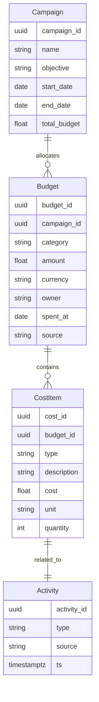

# 💰 ROI計算に必要な「予算モジュール」設計仕様

## 🎯 目的

* DevRel活動（イベント・ブログ・OSS支援・コミュニティ運営など）にかかるコストを記録する。
* ファネル分析・アトリビューションAIと結合し、「施策ごとのROI」を自動算出する。
* クラウド／OSSどちらでも使えるが、**AI分析はCloud専用**にする。

---

## 🧩 モジュール概要

```
drm/
├─ core/
│  ├─ models/
│  │  └─ Budget.ts
│  ├─ api/
│  │  └─ budgets.ts
│  └─ services/
│     └─ roi-calculator.ts
└─ plugins/
   ├─ drm-plugin-ai-attribution/
   └─ drm-plugin-crm/
```

---

## 🗂 データモデル



---

## 📊 入力単位

| 入力カテゴリ    | 例                              | 入力方法               |
| --------- | ------------------------------ | ------------------ |
| **イベント**  | connpass, カンファレンス協賛費, ノベルティ製作費 | 手動登録 or CSV import |
| **人件費**   | スタッフ工数, スピーカー準備                | 時給換算入力             |
| **広告**    | Xプロモーション, note広告枠              | API連携 or 手動        |
| **ツール費用** | MAツール, API利用料                  | 定期費用として登録          |
| **外注**    | 翻訳, デザイン, 編集                   | 契約単位で記録            |

---

## 🧾 予算入力UIイメージ

| 施策名               | 費用区分   | 金額      | 日付         | 関連施策       |
| ----------------- | ------ | ------- | ---------- | ---------- |
| DevRel/Tokyo #101 | イベント   | ¥85,000 | 2025-06-04 | Awareness  |
| OSSスポンサー支援        | コミュニティ | ¥30,000 | 2025-05-20 | Advocacy   |
| note広告            | 広告     | ¥15,000 | 2025-06-01 | Awareness  |
| スピーカー謝礼           | 人件費    | ¥20,000 | 2025-06-04 | Engagement |

※ UIでは「カテゴリ」「チャネル」「担当者」「通貨」などのフィルタが可能。

---

## 🧮 ROI算出ロジック

```
ROI = (効果値 - 投資額) / 投資額
```

### 例:

* 効果値：イベント経由で得られたリード数 × LTV単価
* 投資額：Budget内の該当チャネルの合計

### 拡張式（AIアトリビューション連携時）

```
ROI_weighted = Σ(施策貢献度 × 効果値) / Σ(投資額)
```

AI Attribution Pluginで施策貢献度（0〜1）を掛け合わせ、
複数チャネルに跨る投資の「真の貢献」を算出。

---

## ⚙️ API構成（REST）

| エンドポイント            | メソッド     | 概要                         |
| ------------------ | -------- | -------------------------- |
| `/api/budgets`     | GET      | 予算一覧取得                     |
| `/api/budgets`     | POST     | 新規登録                       |
| `/api/budgets/:id` | PATCH    | 編集                         |
| `/api/campaigns`   | GET/POST | 施策単位の管理                    |
| `/api/roi`         | GET      | ROI算出結果（施策単位）              |
| `/api/roi/ai`      | GET      | AI Attribution連携版（Cloud専用） |

---

## ☁️ クラウド拡張（AI連携）

AI Attribution Pluginが有効な場合、
以下の情報を学習データとして扱う：

| 特徴量            | 取得元          |
| -------------- | ------------ |
| コスト金額・カテゴリ     | `/budgets`   |
| 施策タイプ・期間       | `/campaigns` |
| ファネルデータ        | DRM Core     |
| 匿名行動データ        | PostHog      |
| 成果（登録・API利用など） | CRM連携プラグイン   |

### AI出力例

```
施策: DevRel/Tokyo #101
投入費用: ¥85,000
成果: 32 registrations, 5 active users
ROI (AI-weighted): 3.8x
→ 貢献上位要素: connpass参加者, Twitter投稿, Slack AMAセッション
```

---

## 📈 ダッシュボード統合

### 指標例

| 指標                  | 説明              |
| ------------------- | --------------- |
| Total Spend         | 全施策の総支出額        |
| ROI per Channel     | チャネル別投資対効果      |
| AI Weighted ROI     | AIによる推定貢献度付きROI |
| Cost per Lead       | リード1件あたりコスト     |
| Campaign Efficiency | 施策ごとの費用対成果比率    |

### 表示例

* 円グラフ：施策カテゴリ別費用構成
* 積み上げ棒：ファネル別ROI
* 折れ線：時系列ROI推移
* テーブル：施策ごとのAI寄与率

---

## 🔐 予算データの扱い方（権限）

| 権限ロール         | できること            |
| ------------- | ---------------- |
| **Admin**     | 予算入力・編集・削除・ROI閲覧 |
| **Manager**   | ROI閲覧・予算申請       |
| **Viewer**    | ROI閲覧のみ          |
| **AI Engine** | 読み取り専用（学習用）      |

---

## ✅ このモジュールの価値

| 観点              | 効果                                    |
| --------------- | ------------------------------------- |
| **経営層**         | DevRelを「コスト」ではなく「投資」として可視化できる         |
| **DevRelチーム**   | 施策ごとの効率を測り、次の戦略立案が容易に                 |
| **SaaSビジネスモデル** | 「予算トラッキング機能＋AI ROI分析」でクラウド課金の明確な根拠になる |

---

## 💡 拡張アイデア

* **「ROIシミュレーター」**
  → 投資額・予測効果を入力すると、AIがROIを事前予測。
* **「異常検知」**
  → 費用対効果が著しく低い施策を自動でフラグ。
* **「コストの自動取得」**
  → クラウド請求書（Stripe, Google Cloud, connpass有料API）から自動入力。
